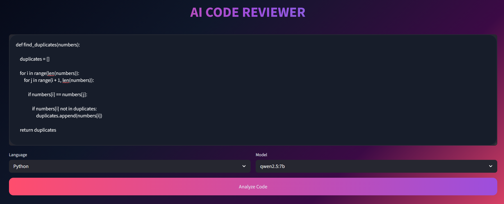
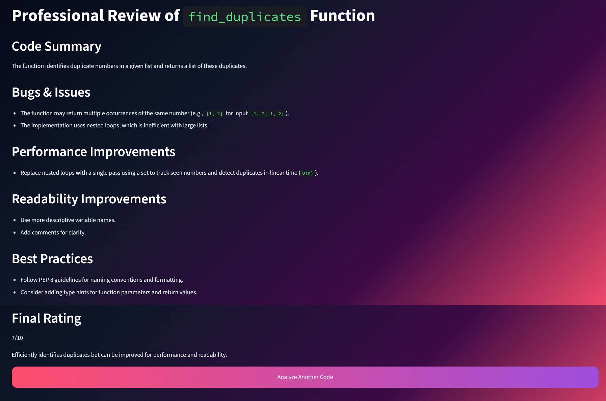

# AI Code Reviewer

An AI-powered code review application built using Streamlit and Ollama.


This project performs local AI-based code reviews using a locally running LLM and generates structured markdown feedback for multiple programming languages.


The goal of this project was to demonstrate:
- local LLM integration
- prompt engineering
- end-to-end AI workflows
- modular Python architecture
- clean UI/UX design
- practical AI engineering skills

---

# Preview

## Home Page



---

## AI Review Result



---

# Features

- Local AI inference using Ollama
- Clean Streamlit UI
- AI-generated structured code reviews
- Markdown-based review rendering
- Multi-language support
- Custom CSS styling
- Modular architecture
- Fully local execution
- Recruiter-friendly project structure

---

# Supported Languages

- Python
- JavaScript
- Java
- C

---

# Tech Stack

- Python
- Streamlit
- Ollama
- Qwen2.5
- CSS

---

# Project Structure

```text
ai-code-reviewer/
│
├── app.py
│
├── services/
│   ├── __init__.py
│   ├── ollama_service.py
│   ├── prompt_service.py
│   └── review_service.py
│
├── ui/
│   └── styles.css
│
├── assets/
│   ├── home.png
│   └── result.png
│
├── requirements.txt
└── README.md
```

---

# How It Works

```text
User Input
    ↓
Prompt Generation
    ↓
Ollama Local Inference
    ↓
LLM Response
    ↓
Markdown Rendering
    ↓
AI Review Output
```

---

# Installation

## 1. Clone The Repository

```bash
git clone https://github.com/csumitwr/ai-code-reviewer
cd ai-code-reviewer
```

---

## 2. Create Virtual Environment

### Windows

```bash
python -m venv venv
venv\Scripts\activate
```

### Mac/Linux

```bash
python3 -m venv venv
source venv/bin/activate
```

---

## 3. Install Dependencies

```bash
pip install -r requirements.txt
```

---

## 4. Install Ollama

Download and install Ollama:

---

## 5. Pull The Model

```bash
ollama pull qwen2.5:7b
```

---

## 6. Run The Application

```bash
streamlit run app.py
```

---

# Example Workflow

1. Paste source code into the editor
2. Select the programming language
3. Click "Analyze Code"
4. The local LLM generates a structured review
5. Review the AI-generated feedback

---

# Future Improvements

- Better markdown rendering
- Additional model support
- Export reviews as PDF
- Syntax highlighting improvements
- Response streaming
- Improved prompt engineering

---

# Notes

- This project runs fully locally
- No cloud APIs are used
- No OpenAI APIs are required
- Ollama handles local model inference
- GPU acceleration is automatically used if supported

---

# License

This project is open-source and available under the MIT License.